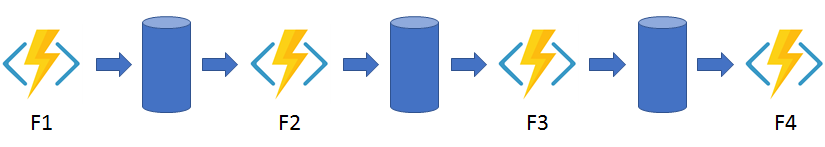

### Azure Durable Functions with Python

Implements a combination of Async HTTP API Pattern along with function chaining
  


- Create a durable function and test locally  
`func start`

- Create a Function on a standard ASP, Y1  
`az functionapp create --resource-group <Resource Group Name> --consumption-plan-location <Location> --runtime python --runtime-version <PYTHON Runtime version> --functions-version 4 --name <Unique app name> --os-type linux --storage-account <Storage Account Name>`

- Publish to Function app
`func azure functionapp publish <Function App Name>`

- Steps to deploy the same to ASEv3 in Isolated environment
1. Create Resource Group
`az group create --name <RG Name> --location <Location>`

2. Create Storage Account
`az storage account create --name <Storage Account Name> --resource-group <Resource Group Name> --location <Location> --sku Standard_LRS`

3. Create Environment using main.bicep
`az deployment group create --resource-group <Resource Group Name> --template-file main.bicep`

4. Create a Function App
`--resource-group <Resource Group Name> --runtime python --runtime-version <PYTHON Runtime version> --functions-version 4 --name <Unique app name> --os-type linux --storage-account <Storage Account Name> --plan isolated-asp-asev3`

5. Deploy the Function App with CI/CD
NOTE:  
```
You can publish by any of the following methods:

Web deployment
Continuous integration (CI)
Drag-and-drop in the Kudu console
An integrated development environment (IDE), such as Visual Studio, Eclipse, or IntelliJ IDEA
With an internal VIP App Service Environment, the publishing endpoints are only available through the inbound address. If you don't have network access to the inbound address, you can't publish any apps on that App Service Environment. Your IDEs must also have network access to the inbound address on the App Service Environment to publish directly to it.

Without additional changes, internet-based CI systems like GitHub and Azure DevOps don't work with an internal VIP App Service Environment. The publishing endpoint isn't internet accessible. You can enable publishing to an internal VIP App Service Environment from Azure DevOps, by installing a self-hosted release agent in the virtual network.
```

6. Clean up
`az group delete --name <RG name>`