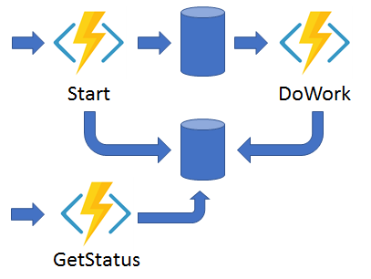

### Azure Durable Functions with Python

Implements a combination of Async HTTP API Pattern along with function chaining
  

- Create a durable function and test locally  
`func start`

- Deploy both to Azure on a standard ASP, Y1  
`az functionapp create --resource-group <Resource Group Name> --consumption-plan-location <Location> --runtime python --runtime-version <PYTHON Runtime version> --functions-version 4 --name <Unique app name> --os-type linux --storage-account <Storage Account Name>`

- Publish to Function app
`func azure functionapp publish <Function App Name>`

- Steps to deploy the same to ASEv3 in Isolated environment
1. Create Resource Group
`az group create --name <RG Name> --location <Location>`

2. Create Storage Account
`az storage account create --name <Storage Account Name> --resource-group <Resource Group Name> --location <Location> --sku Standard_LRS`

3. Create Environment using main.bicep
`az deployment group create --resource-group <Resource Group Name> --template-file main.bicep`

4. Create a Function App
`--resource-group <Resource Group Name> --runtime python --runtime-version <PYTHON Runtime version> --functions-version 4 --name <Unique app name> --os-type linux --storage-account <Storage Account Name> --plan isolated-asp-asev3`

5. Deploy the Function App with CI/CD
- Create Federated Credentials: https://learn.microsoft.com/en-us/azure/developer/github/connect-from-azure?tabs=azure-portal%2Clinux
- Set WEBSITE_RUN_FROM_PACKAGE=1 in the Application Settings

6. Clean up
`az group delete --name <RG name>`